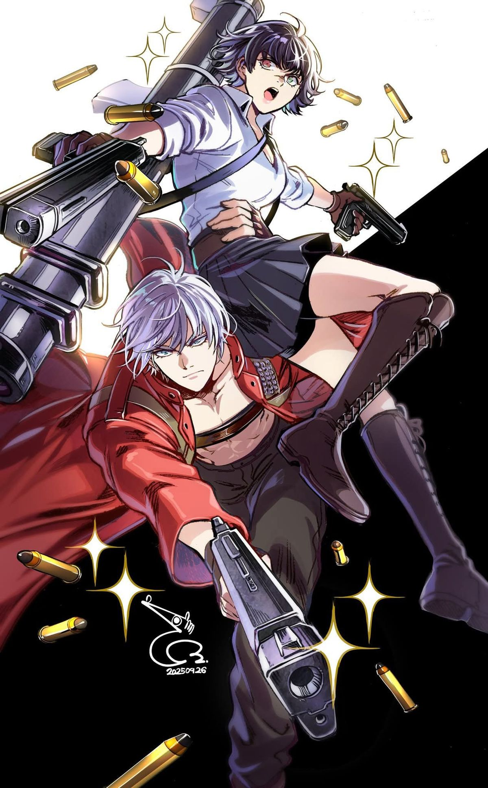

# JustAnotherKave

<h2 align="center"> 👨🏻‍💻 &nbsp;A Little Bit About Me and My Interests</h2>

  
  
    
  <a href="https://api.github-star-counter.workers.dev/user/JustAnotherKave">
     
  </a>
  

 

<!-- Tabella per mantenere il testo separato dall'immagine -->
<table border="0">
  <tr>
    <!-- Cella Immagine -->
    <td width="30%" valign="top">
      
    </td>
    <!-- Cella Testo -->
    <td width="70%" valign="top">
      <b>
        I'm a third-year high school student, and I study Computer Science!  
        I learned how to code in C and C++, but now we're programming in Java! And man... it's so beautiful. I wrote some very pretty code for a Pokemon Fight, and I'm looking to improve it.  
        We also study Assembly... I'm not going to talk about that... I still have traumas...   
        But talking about life outside of school, my interests are:
        <ul>
          <li><b>Listening to music:</b>
            <ol>
              <li>Linkin Park (my favorite)</li>
              <li>Limp Bizkit</li>
              <li>Korn</li>
              <li>The Neighbourhood</li>
            </ol>
          </li>
          <li><b>Watching anime:</b>
            <ol>
              <li>Evangelion (as you can see by my pfp)</li>
              <li>Fullmetal Alchemist</li>
              <li>Bleach</li>
              <li>Chainsaw Man</li>
            </ol>
          </li>
          <li><b>Playing videogames:</b>
            <ol>
              <li>Devil May Cry (also, as you can see)</li>
              <li>Souls-likes</li>
              <li>Baldur's Gate III</li>
            </ol>
          </li>
          <li>Hang-out</li>
          <li>Play Dungeons & Dragons</li>
        </ul>
      </b>
    </td>
  </tr>
</table>

<h2 align="center"> 🚀 &nbsp;Some Tools I Have fun using</h2>

  
  
  
  
  

<!-- Sezione Contributions (Grafico superiore) -->

  <h2>What obsession can do</h2>
  

 

